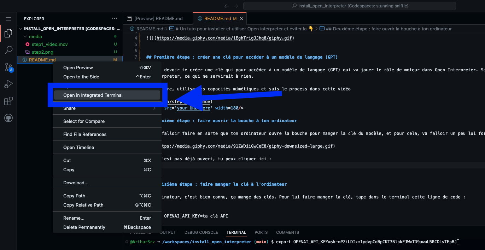
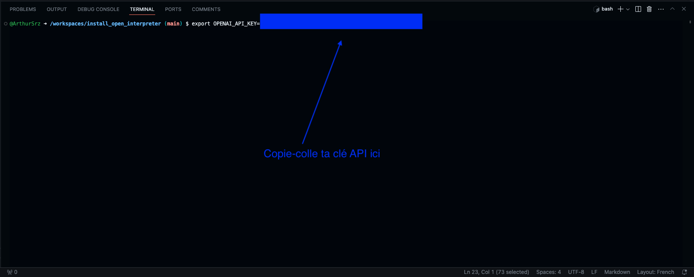
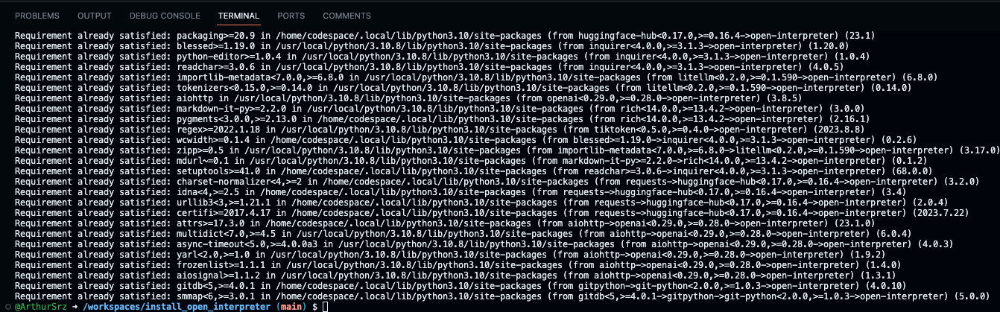

# Un tuto pour installer et utiliser Open interpreter et éviter la 👇


## Première étape : créer une clé pour accéder à un modèle de langage (GPT)

Tu vas devoir te créer une clé qui pour accéder à un modèle de langage (GPT) qui va jouer le rôle de moteur dans Open Interpreter. Sans modèle de langage, tu ne pourras pas parler à l'interpreter, ce qui ne servirait à rien. 

Pour faire, utilise tes capacités mimétiques et suis le process dans cette vidéo 


<video src='your URL here' width=180/>


## Deuxième étape : faire ouvrir la bouche à ton ordinateur

Il va falloir faire en sorte que ton ordinateur ouvre la bouche pour manger la clé du modèle, et pour cela, va falloir un peu lui forcer la main en ouvrant **le Terminal** (😱🪦😭).  


S'il n'est pas déjà ouvert, tu peux cliquer ici : 




## Troisième étape : faire manger la clé à l'ordinateur

Un ordinateur, c'est bien connu, ça mange des clés. Pour lui faire manger la clé, tape dans le terminal cette ligne de code :

```
export OPENAI_API_KEY=ta clé API
```

De cette manière :



Puis appuie sur ⏎


## Quatrième étape : incorporer Open Interpreter à ton ordinateur

Là, il va falloir incorporer Open Interpreter à ton ordinateur. Ca veut dire télécharger open interpreter de manière à ce qu'il fasse partie de l'ordinateur et que tu puisses l'utiliser quand tu veux. 

Dans le terminal encore : 

```
pip install open-interpreter
```

Puis appuie sur ⏎

Résultat, plein de lignes terrifiantes font défiler (voir ci-dessous). Pas de panique, c'est tout à fait normal. 




## Cinquième étape : allumer Open interpreter

Vous avez le feu vert pour allumer Open interpreter


Pour cela, toujours dans le Terminal : 

```
interpreter --fast
```

Pourquoi le "--fast" ? Parce que cela va permettre d'allumer Open interpreter sur GPT 3-5 qui est NETTEMENT moins cher que GPT 4. Moins cher c'est à dire que GPT 4 va vous couter 20 € par mois si vous l'utilisez relativement intensément, et GPT 3-5 aux environs de 0.60 €. Et pour l'avoir testé, GPT 3-5 est LARGEMENT assez performant quand on est pas geek ou data scientist de naissance. 

## Sixième étape : Dire bonjour à Open Interpreter et lui poser une première question


## Septième étape : réaliser tout ce que vous allez pouvoir faire maintenant.


